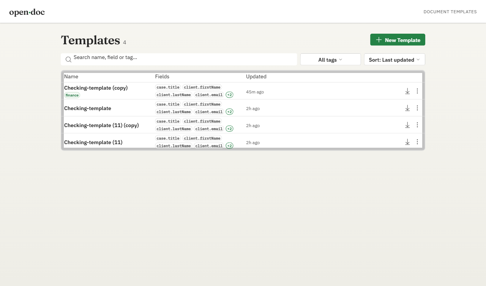

# open-doc

[](https://github.com/ofir6868/open-doc/actions/workflows/ci.yml) [](LICENSE) [](docker-compose.yml)

The **complete, self-hosted** Word document automation stack — template
mapping, management, and generation — all open-source, all on your own
infrastructure. No cloud dependency, no data leaving your network.



Most existing tools only solve one piece of the puzzle: a generation-only
library with no UI, or a cloud SaaS that your documents must pass through.
open-doc ships the full lifecycle in a single `docker compose up`:

- **Word add-in** — map fields directly inside Word using real *content
  controls*; no custom syntax, no XML editing.
- **Web UI + REST API** — upload, preview, and manage templates from a
  browser; generate filled `.docx` files by POSTing JSON to one endpoint.
- **Seamless fills** — values go into the document's existing runs, preserving
  fonts, bold/italic, RTL/Hebrew direction, and layout exactly.
- **On-premise** — runs as two containers on your own server. Sensitive
  documents never leave your infrastructure.

---

## Architecture

```
┌─────────────┐     maps fields      ┌──────────────────────────────┐
│  Word add-in│ ───────────────────► │  apps/server  (NestJS API)   │
│ apps/addin  │  (content controls)  │                              │
└─────────────┘                      │  docx engine:                │
                                     │   • reader  (pizzip + XML)   │
┌─────────────┐   upload / generate  │   • renderer (fill + unwrap) │
│  Web UI     │ ───────────────────► │  storage: filesystem adapter │
│ apps/web    │                      │  schema:  config/schema.json │
└─────────────┘                      └──────────────────────────────┘

libs/shared — shared TypeScript types and schema-traversal helpers
```

| Project        | Stack                                | Dev port |
| -------------- | ------------------------------------ | -------- |
| `apps/server`  | NestJS 11, webpack                   | 3000     |
| `apps/web`     | React 19, Vite, Fluent UI v9         | 3002     |
| `apps/addin`   | Office.js, React, Vite (HTTPS)       | 3001     |
| `libs/shared`  | TypeScript types + schema helpers    | —        |

The engine lives in `apps/server/src/docx`: the **reader** unzips the `.docx`
and parses `word/document.xml`, locating tagged content controls (`<w:sdt>` with
a `<w:tag>`); the **renderer** fills each tagged control's value into its
existing runs, then unwraps the control so no editing chrome remains.

---

## Quick start (local dev)

Requires **Node 20+**. Install once:

```sh
npm ci
```

Run the API and web UI in separate terminals:

```sh
npm run dev:server   # http://localhost:3000/api
npm run dev:web      # http://localhost:3002  (proxies /api to the server)
```

Open <http://localhost:3002>. To try generation immediately, upload one of the
ready-made templates from [`examples/templates`](examples/templates) (they're
already field-mapped — no add-in needed).

Configuration is read from a `.env` file in the repo root (copy `.env.example`):

| Variable           | Default        | Purpose                                            |
| ------------------ | -------------- | -------------------------------------------------- |
| `PORT`             | `3000`         | API port                                           |
| `HOST`             | `0.0.0.0`      | API bind host                                      |
| `TEMPLATE_DIR`     | `./templates`  | Where templates and their `.meta.json` are stored  |
| `SCHEMA_URL`       | _(empty)_      | Fetch the field schema from a URL instead of file  |
| `SCHEMA_CACHE_TTL` | `60`           | Schema cache lifetime (seconds)                    |
| `STRICT_MODE`      | `false`        | If `true`, generation fails when fields are missing|
| `CORS_ORIGINS`     | `*`            | Allowed CORS origins                               |

When `SCHEMA_URL` is empty, the field catalog is read from
[`config/schema.json`](config/schema.json) — edit it to define the fields your
add-in offers when mapping.

---

## Run with Docker

```sh
docker compose up --build
```

- Web UI → <http://localhost:8080> (nginx serves the static build and proxies
  `/api` to the server container)
- API → <http://localhost:3000/api>

Templates persist in the `templates` named volume; `config/schema.json` is
mounted read-only so you can edit the field catalog on the host.

---

## The templating workflow

1. **Upload** your original `.docx` in the web UI. The server returns a copy
   suffixed `-template` for you to download.
2. **Map fields** in Word: open the downloaded file, run the open-doc add-in,
   and insert a content control at each spot that should be filled. Each control
   is tagged with a field path from your schema (e.g. `client.firstName`).
3. **Re-upload** the mapped file. The confirm step renders the document with a
   faithful preview and lists the detected fields.
4. **Generate** by POSTing JSON data:

   ```sh
   curl -X POST http://localhost:3000/api/generate \
     -H "Content-Type: application/json" \
     -d '{"templateId":"nda-template","data":{"party":{"disclosing":"Acme Corp."}}}' \
     --output filled.docx
   ```

### API surface

| Method & path                     | Purpose                                  |
| --------------------------------- | ---------------------------------------- |
| `GET  /api/health`                | Liveness check                           |
| `GET  /api/schema`                | Field catalog (for the add-in tree)      |
| `GET  /api/templates`             | List templates                           |
| `POST /api/templates/prepare`     | Return a `-template` copy of an upload   |
| `POST /api/templates/preview`     | Detect fields in a mapped `.docx`        |
| `POST /api/templates`             | Store a template                         |
| `GET  /api/templates/:id/download`| Download the stored `.docx`              |
| `DELETE /api/templates/:id`       | Delete a template                        |
| `POST /api/generate`              | Generate a filled `.docx`                |
| `POST /api/generate/preview`      | HTML preview of a filled document        |

---

## Word add-in (local sideload)

The add-in is served over HTTPS on port 3001. Generate the dev certificate
once, then start it and sideload into the Word desktop app:

```sh
npx office-addin-dev-certs install      # one-time: trust the localhost cert
npm run dev:addin                       # serves the add-in on https://localhost:3001
npm run sideload:addin                  # opens Word with the add-in loaded
```

In Word the add-in appears under the **Home** tab. Select where a value belongs,
pick the field in the add-in, and it inserts a tagged content control. Save and
re-upload through the web UI.

---

## Example templates

`examples/templates` ships three ready-to-use, pre-mapped templates:

- `nda-template.docx` — mutual non-disclosure agreement
- `employment-letter-template.docx` — offer letter
- `invoice-template.docx` — simple invoice

Regenerate them with `npm run examples`. Their field tags match
`config/schema.json`.

---

## Common commands

```sh
npm run dev:server      # NestJS API (watch)
npm run dev:web         # web UI (Vite)
npm run dev:addin       # Word add-in (HTTPS Vite)
npm run build:server    # production server bundle  -> apps/server/dist
npm run build:web       # production web bundle      -> apps/web/dist
npm test                # unit tests (vitest)
npm run typecheck       # typecheck server + web
npm run examples        # regenerate example templates
```

This is an [Nx](https://nx.dev) workspace; you can also drive projects directly,
e.g. `npx nx serve server` or `npx nx build server`.

---

## Contributing

See [CONTRIBUTING.md](CONTRIBUTING.md). Licensed under [MIT](LICENSE).
